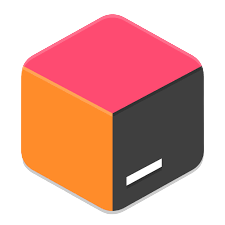

<!--
❗ ➤ REFERENCES USED IN THIS REPOSITORY:
🔗 • https://github.com/kyechan99/capsule-render
🔗 • https://github.com/antonkomarev/github-profile-views-counter
🔗 • https://github.com/DenverCoder1/custom-icon-badges
🔗 • https://github.com/DenverCoder1/github-readme-streak-stats
🔗 • https://github.com/Ashutosh00710/github-readme-activity-graph
🔗 • https://github.com/anuraghazra/github-readme-stats
🔗 • https://readme-typing-svg.demolab.com/demo/
🔗 • https://github.com/alexandresanlim/Badges4-README.md-Profile
🔗 • https://github.com/novatorem/novatorem
🔗 • https://profilepicturemaker.com
🔗 • https://devicon.dev
🔗 • https://shields.io
🔗 • https://giphy.com
🔗 • https://emoji.gg
🔗 • https://getemoji.com
-->

  

  

<!-- ABOUT ME -->

###  Hey!

 
  **▸ Ich mache derzeit mein Fachabitur im Bereich Informationswirtschaft.**
 

###  Meine Hobbies:

 
  🎮 `Games` • 💻 `Programmieren` • 🏦 `Politik` • 🎧 `Musik`

<!--###  In what I study for now, I can quote:

  - **Algorithms & Programming Logic**
  - **Visual Programming Language**
  - **Software Engineering**
  - **Operational Systems**
  - **Databases**

 -->

<!-- SKILLS -->

### &nbsp; Main skills:

  &nbsp;&nbsp;
  &nbsp;&nbsp;
  &nbsp;&nbsp;
  &nbsp;&nbsp;
  &nbsp;&nbsp;
  &nbsp;
  &nbsp;&nbsp;
    &nbsp;&nbsp;
    

 

  

 

<!-- STATS -->

  

  

  
  

  

  

<!-- THANKS FOR VISITING -->

  

 

  
<b>Besucher</b>
  
  

    
  
 

 

  

  

